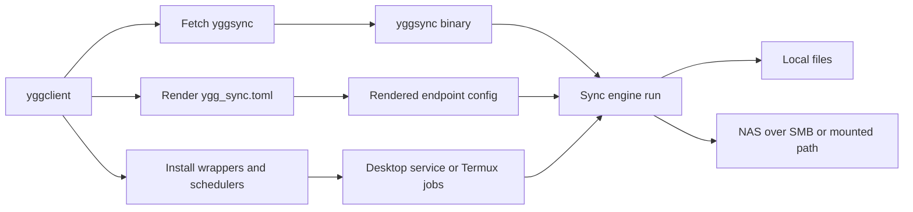
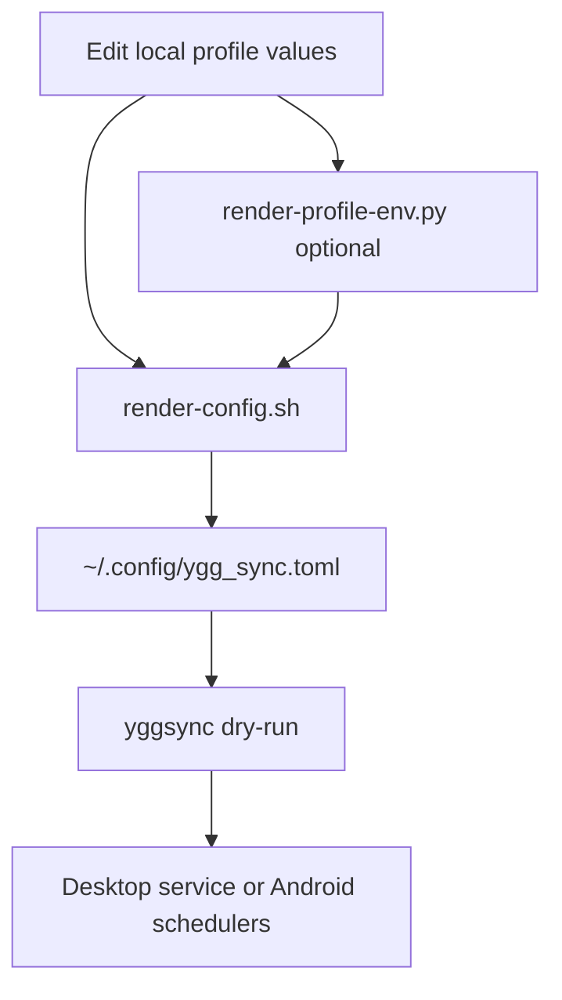
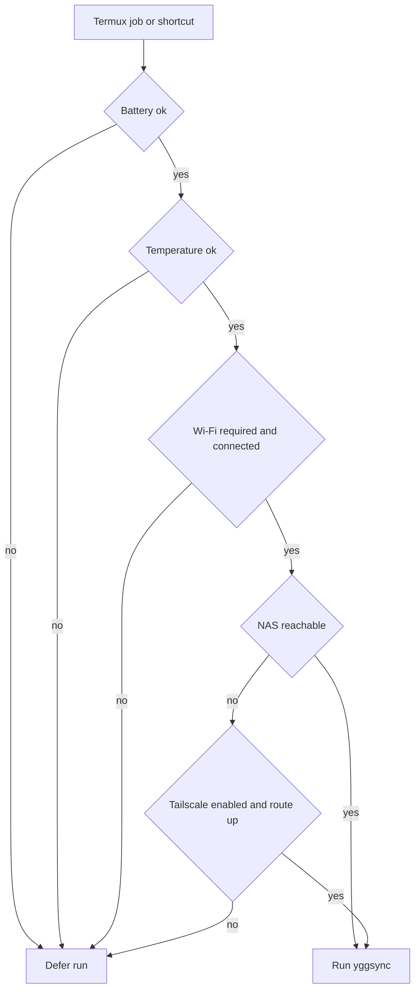

# yggclient

Client-side automation for Yggdrasil endpoints.

`yggclient` does not replace `yggsync`. It installs, renders, schedules, and guards it on real endpoint machines such as laptops and Android phones.

This README is the operator manual for setting up those endpoints.

## Overview

`yggclient` owns:

- `yggsync` fetch and install wrappers
- config rendering for endpoint-specific `~/.config/ygg_sync.toml`
- desktop service and timer helpers
- Android Termux setup, shortcuts, and schedulers
- Android runtime policy for battery, temperature, Wi-Fi, and reachability



## Concepts

### Repo Boundaries

- `yggsync` owns the sync engine and TOML schema
- `yggclient` owns endpoint policy and operator glue

That means device-specific behavior such as:

- battery thresholds
- thermal limits
- Wi-Fi-only policy
- Tailscale-aware reachability checks
- Termux widgets and job scheduling

belongs here, not in `yggsync`.

### Two Config Layers

`yggclient` supports two ways to feed values into the generated `yggsync` config:

- environment-first via `config/profiles.local.env`
- TOML-first via `yggclient.local.toml`

Both lead to the same rendered file:

- `~/.config/ygg_sync.toml`



## What You Edit

For most setups, you only need to set a few values.

### Core Variables

- `SAMBA_HOST`: NAS hostname or IP
- `SAMBA_SHARE`: SMB share name, usually `data`
- `SAMBA_USER`: path owner used in remote paths
- `SAMBA_USERNAME`: SMB login account
- `SAMBA_PASSWORD_ENV`: usually `SAMBA_PASSWORD`
- `SCREENCASTS_REMOTE`: only if the default screencast path is wrong for this machine

Important distinction:

- `SAMBA_USERNAME` is the SMB login name
- `SAMBA_USER` is the username embedded in remote paths

When auth and path ownership differ, set both explicitly.

### Environment-First

Copy:

- `config/profiles.example.env`

to:

- `config/profiles.local.env`

Then edit the variables above.

### TOML-First

Copy:

- `yggclient.example.toml`

to:

- `yggclient.local.toml`

Then edit the `[sync]` fields and generate the compatibility env file:

```bash
python3 scripts/render-profile-env.py
```

## First Run

### Laptop

This is the shortest realistic desktop flow.

1. Clone the repo.
2. Set local profile values.
3. Fetch `yggsync`.
4. Render `~/.config/ygg_sync.toml`.
5. Dry-run a small job.
6. Install the service or timer only after the dry-run looks sane.

```bash
mkdir -p ~/gh
cd ~/gh
git clone https://github.com/yggdrasilhq/yggclient.git
cd ~/gh/yggclient

cp config/profiles.example.env config/profiles.local.env
# edit config/profiles.local.env

bash scripts/yggsync/fetch-yggsync.sh
bash scripts/yggsync/render-config.sh desktop
export SAMBA_PASSWORD='your-password'
~/.local/bin/yggsync -config ~/.config/ygg_sync.toml -list
~/.local/bin/yggsync -config ~/.config/ygg_sync.toml -jobs screenshots-desktop -dry-run
```

If you want the desktop service and timer:

```bash
bash scripts/install/install-service.sh
```

### Android From Fresh Termux

This is the shortest realistic phone flow.

Install these Android apps first:

- `Termux`
- `Termux:API`
- `Termux:Boot`

Then in Termux:

```bash
pkg update
pkg install -y git openssh
mkdir -p ~/gh
cd ~/gh
git clone https://github.com/yggdrasilhq/yggclient.git
cd ~/gh/yggclient

bash android/scripts/bootstrap.sh
bash android/scripts/fetch-yggsync.sh
bash android/scripts/install.sh
bash scripts/yggsync/render-config.sh android
export SAMBA_PASSWORD='your-password'
bash android/scripts/setup-android-sync.sh
~/.local/bin/yggsync -config ~/.config/ygg_sync.toml -jobs screenshots -dry-run
```

## Normal Operation

### Desktop

Normal desktop usage is:

1. keep profile values in `config/profiles.local.env` or `yggclient.local.toml`
2. re-render when those values change
3. let the user service or timer run the selected jobs

Key files:

- `scripts/yggsync/fetch-yggsync.sh`
- `scripts/yggsync/render-config.sh`
- `scripts/yggsync/run-desktop-yggsync.sh`
- `config/yggsync/desktop/ygg_sync.toml.template`

### Android

Normal Android usage is:

1. keep the rendered config in `~/.config/ygg_sync.toml`
2. let Termux jobs or shortcuts invoke the wrappers
3. let the wrappers defer runs when the phone conditions are bad

Key files:

- `android/config/ygg_sync.toml.template`
- `android/config/ygg_client.env.example`
- `android/scripts/setup-android-sync.sh`
- `android/scripts/update-public-stack.sh`

Manual Obsidian commands remain explicit:

```bash
~/.local/bin/yggsync -config ~/.config/ygg_sync.toml -jobs obsidian -worktree-op update
~/.local/bin/yggsync -config ~/.config/ygg_sync.toml -jobs obsidian -worktree-op commit
~/.local/bin/yggsync -config ~/.config/ygg_sync.toml -jobs obsidian -worktree-op sync
```

## Mounted NAS Desktop Variant

If a laptop already uses the NAS through a mounted path for day-to-day work, you can keep that model.

Pattern:

1. render the normal desktop config once
2. replace `nas:...` remotes in `~/.config/ygg_sync.toml` with absolute mounted paths such as `/mnt/nas/data/...`
3. guard the service so it only runs when that path is actually mounted

Example systemd drop-in:

```ini
[Unit]
ConditionPathIsMountPoint=/mnt/nas/data
```

This keeps the laptop aligned with an existing SMB-mounted workflow and avoids embedding SMB credentials into the user service.

## Android Runtime Policy

The Android wrappers perform live checks before and during a run.

They can:

- defer if the battery is low
- defer if the phone is too hot
- require Wi-Fi
- check whether the NAS is reachable
- defer when the NAS is unreachable and Tailscale is off
- stop the current run if conditions turn bad mid-run



Optional runtime overrides live in:

- `~/.config/ygg_client.env`

Start from:

- `android/config/ygg_client.env.example`

Main knobs:

- `YGG_REQUIRE_WIFI=1`
- `YGG_MIN_BATTERY_FAST=50`
- `YGG_MIN_BATTERY_BULK=65`
- `YGG_MAX_BATTERY_TEMP_FAST_C=39.5`
- `YGG_MAX_BATTERY_TEMP_BULK_C=38.5`
- `YGG_MONITOR_INTERVAL_SECONDS=20`
- `YGG_HOST_CHECK_TIMEOUT_SECONDS=3`
- `YGG_TAILSCALE_BIN=tailscale`

## Obsidian Guidance

Two workflows are supported:

- direct SMB-mounted vault, if you personally keep exactly one live machine active at a time
- local vault plus `worktree` sync, if you want safer handoff semantics and explicit conflict detection

For Android, the recommended pattern is local storage plus `worktree`.
For a disciplined laptop workflow, the mounted-vault path is acceptable, but it is still not a multi-writer collaboration model.

## Troubleshooting

### Wrong remote path even though auth works

Check whether `SAMBA_USERNAME` and `SAMBA_USER` are supposed to differ.
The first is for login. The second is for remote path layout.

### Desktop timer runs against the wrong directory

If you use the mounted-share variant, the mount is probably missing.
Add `ConditionPathIsMountPoint=` to the service drop-in.

### Android says deferred instead of failed

That is normal when the wrappers intentionally skip the run because of:

- low battery
- heat
- no Wi-Fi
- unreachable NAS
- Tailscale not enabled

### Obsidian still produces junk or conflicts

Usually this means one of these:

- the vault is being edited from more than one live machine
- `.obsidian` and other high-churn paths were not filtered
- the job should be `worktree`, not generic sync

## Why This Repo Exists

`yggsync` is the portable engine.
`yggclient` makes it sane on actual endpoint devices.

Without `yggclient`, every laptop and phone would need hand-rolled wrappers for:

- install paths
- config rendering
- scheduling
- environment policy
- platform-specific behavior

That is the exact operational burden this repo removes.
